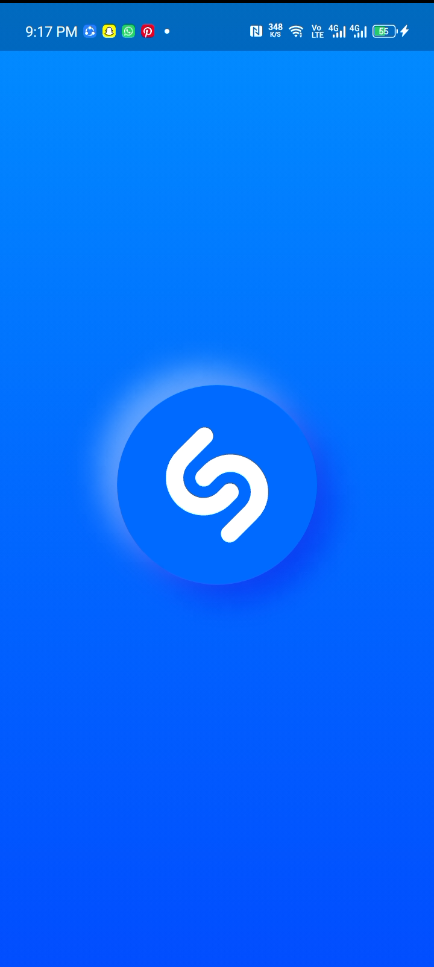
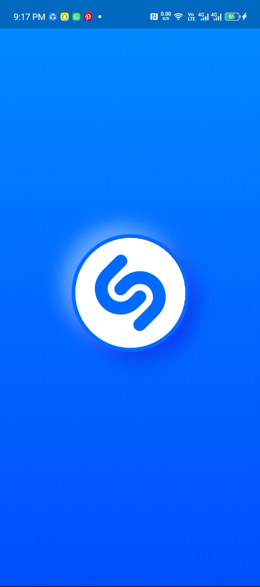
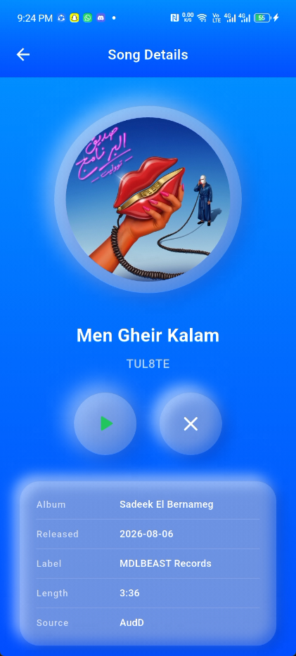

<div align="center">

# 🎧 Neumorphic Shazam

### A song-recognition Flutter app wrapped in soft, tactile *Neumorphism*.

Recognize any song by tapping a button. Watch the ripple waves pulse, the logo draw itself,
and every surface glow with light shadow on the top-left and dark shadow on the bottom-right.

<br>


[](http://makeapullrequest.com)

</div>

---

## ✨ Features

| | |
|---|---|
| 🧿 **Neumorphic UI everywhere** | Raised & inset surfaces, tinted soft shadows — from the button up to the details screen |
| 🌊 **Sonar ripple button** | Staggered light/dark waves expand while listening; a satisfying press-in on tap |
| ✍️ **Animated splash** | The logo erases & redraws along its path, pulses, then **morphs** into the listening orb |
| 🎙️ **Heart of the app** | Tap-and-record: 12 seconds of audio, then auto-recognition |
| 🧠 **Dual recognition engine** | ACRCloud (with custom bucket) first, AudD as global fallback |
| 🎧 **Rich song details** | Artwork, album, label, genres, confidence & deep links to Apple Music / Spotify / Deezer |
| 🌍 **Localization-ready** | `easy_localization` wiring out of the box |
| 🗂️ **Clean architecture** | Presentation / Domain / Data layers with `Bloc` + `get_it` |

---

## 📱 Screenshots

<div align="center">

| Splash | Home | Song Details |
|:---:|:---:|:---:|
|  |  |  |

*The splash orb morphs into the listening button — one continuous neumorphic surface.*

</div>

---

## 🏗️ Tech Stack

| Layer | Choice |
|---|---|
| 🖼️ **UI** | Flutter, Material 3, `flutter_screenutil` |
| ⚙️ **State** | `flutter_bloc` (Cubits) + `flutter_hooks` |
| 🧭 **Navigation** | `go_router` with seamless fade / Hero morph transitions |
| 💉 **DI** | `get_it` |
| 🌐 **Networking** | `dio` + `retrofit` |
| 🧬 **Data classes** | `freezed` / `json_serializable` |
| 🔍 **Recognition** | ACRCloud `MultiSongProvider` → AudD fallback |
| 🎙️ **Audio** | `record` package (device microphone) |
| 🔥 **Backend** | Firebase (Core, Auth, Firestore, Analytics, Crashlytics) |
| 📝 **Logging** | `logger` |

---

## 📂 Project Structure

```
lib/
├── core/
│   ├── constants/          # API keys & endpoints
│   └── di/                 # get_it modules
└── src/
    ├── app.dart            # MaterialApp.router + theming
    ├── flavors.dart        # development / production flavors
    ├── routing/            # go_router config + shared Hero tags
    ├── services/           # dio, storage, permissions, location…
    ├── theme/              # colors, text, shadows, curves
    ├── shared/             # reusable widgets (neumorphic, cards…)
    └── features/
        ├── splash/         # animated neumorphic splash → morph
        └── home/           # listening button, recognition, details
            ├── data/       # datasources + repository + providers
            ├── domain/     # entities + usecases
            └── presentation/  # cubit, state, screens, widgets
```

---

## 🚀 Getting Started

### Prerequisites

- Flutter SDK **3.24+** (Dart 3.5+)
- A device or emulator **with a microphone**

### 1. Install dependencies

```bash
flutter pub get
```

### 2. Configure environment (`.env`)

Recognition needs **at least one provider token**. Without any token, the app runs in
**demo mode** and returns a mock song so you can explore the UI.

| Key | Required | Purpose |
|---|---|---|
| `AUDD_API_TOKEN` | optional | AudD global recognition |
| `AUDD_BASE_URL` | optional | AudD endpoint (defaults to `api.audd.io`) |
| `ACRCLOUD_ACCESS_KEY` | optional | ACRCloud key |
| `ACRCLOUD_ACCESS_SECRET` | optional | ACRCloud secret |
| `ACRCLOUD_HOST` | optional | Your ACRCloud region host |

### 3. Run it

```bash
# Development flavor (default)
flutter run                        # or: flutter run --dart-define=APP_FLAVOR=development

# Production flavor
flutter run --dart-define=APP_FLAVOR=production
```

> #### How recognition works 🧠
> 1. You tap the **listening orb** — microphone permission is requested automatically.
> 2. `AudioLocalDataSource` records **12 seconds** while the sonar ripples spin.
> 3. `MultiSongProvider` queries **ACRCloud** first (great regional + custom-bucket coverage),
>    then falls back to **AudD** for the global catalog.
> 4. On a match you land on the details screen; otherwise a friendly error is shown.

---

## 🧭 Navigation (the “premium” part)

- **Splash → Home**: the drawn logo melts into the orb via a **Hero morph** —
  pixel-identical size & center, so the swap is invisible.
- **Home → Details**: pushed on top with the same soft fade; the back button
  returns you to a freshly reset orb.

---

## 🛠️ Quality

```bash
flutter analyze    # static analysis
flutter test       # unit / widget tests
```

---

## 🗺️ Roadmap

- [ ] Listening history / recently recognized
- [ ] Background recognition
- [ ] Lyrics & key sections (intro, outro)
- [ ] Shareable result cards

---

<div align="center">

**Built with ❤️ in Flutter — soft shadows, loud music.**

</div>